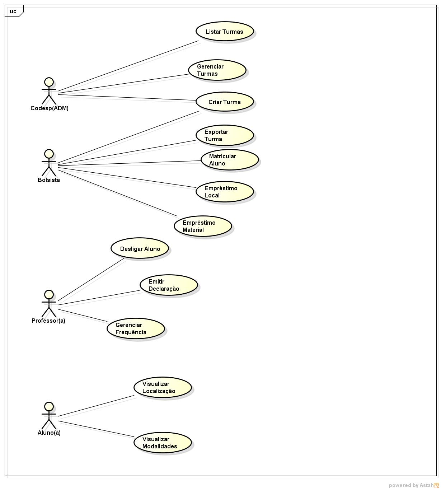

# Modelo de Casos de Uso

## 1. Diagrama de Casos de Uso

## 2. Listagem dos detalhamentos dos casos de uso (implementados) por ordem de prioridade

1. [CDU-001 - Criar Turma](cdu-001/detalhamento-001.md)
2. [CDU-002 - Listar Turma](cdu-002/detalhamento-002.md)
3. [CDU-003 - Gerenciar Turma](cdu-003/detalhamento-003.md)
4. [CDU-004 - Exportar Turma](cdu-004/detalhamento-004.md)
5. [CDU-005 - Emitir Declaração](cdu-005/detalhamento-005.md)
6. [CDU-006 - Matricular Aluno](cdu-006/detalhamento-006.md)

