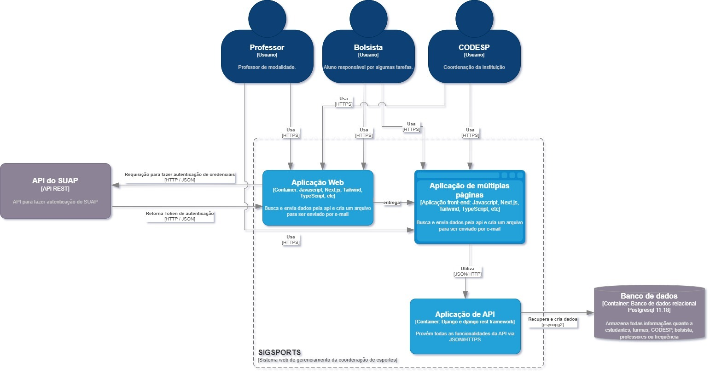

**Sigsports**

**Documento de Arquitetura do Sistema**

**Histórico da Revisão**

| **Data** | **Versão** | **Descrição** | **Autor** |
| --- | --- | --- | --- |
| dd/mm/aaaa | 1.0 | Versão inicial do sistema | Luiz Felipe, Mayra Perpétua, Valtércio Santiago e Renato Berna |

# 1. Introdução

O Sig Sports trata-se de um Sistema de Gerenciamento de Esportes que está sendo desenvolvido para a coordenação de esportes do IFRN campus Natal Central. Os objetivos são:

- Melhorar a experiência de realização de matrículas dos alunos
- Facilitar parte do trabalho de gestão de alunos para professores e coordenação, como frequência, emitir declaração e exportar dados de uma turma em arquivos de fácil acesso.
- Divulgar informações importantes como esportes oferecidos e respectivas vagas disponíveis

# 2. Termos e Abreviações

| Termo              |  Significado               |  
| :-----------------: | :-----------------: |
| Bolsista | Bolsista é o ator secundário(semelhante a um estagiário) responsável por fazer solicitações de matrícula e registrar os espaços|
| Codesp | São os atores com mais permissões que trabalham na coordenação de esportes | 
| modalidade | Cada esporte oferecido pela CODESP. |
| Categoria de modalidade | Níveis de experiência de uma modalidade com a finalidade de categorizar uma turma(Escolinha, Iniciante, Intermediário, Avançado, Turma profissional). |
| Matrícula	| Número identificador gerado pelo suap para identificar o estudante. | 
| Turma | Um conjunto de informações como matricula, professor, modalidade formam uma turma |
| Backend | Software responsável pelo mecanismo que processa dados e realiza ações em websites |
| Frontend | Software responsável pela interação com interfaces | Conjunto de dados, instruções ou programas usados para fazer operações em computadores |
| Exportar Turma| Funcionalidade que permite ser gerado um arquivo contendo todas as informações de uma turma |
| Declaração | Funcionalidade que permite ser gerado um arquivo contendo a situação de matriculado de um aluno | 

# 3. Requisitos Significantes

## RAS do Elemento
| Código              |  Nome               |          Descrição  |  
| :-----------------: | :-----------------: | :-----------------: |
| RAS01 |  Controle de acesso a Usuário| Somente Bolsistas relacionadas com a CODESP e professores conseguirão obter acesso à a algumas funcionalidades da aplicação. |  
| RAS02 | Diversidade de dispositivos | O sistema deverá funcionar em dispositivos diferentes sem perda de qualidade  | Adaptabilidade | Desejável |
| RAS03 | Funcionamento limitado | O sistema deverá estar funcionando de maneira limitada em caso de conexão falha ao banco de dados remoto

# 4. Restrições Arquiteturais

## 4.1 Restrições técnicas
### 4.1.1 Restrições de software e programação
| Código              |  Restrição               |          Contexto e/ou motivação  |  
| :-----------------: | :-----------------: | :-----------------: |
| RT1 |  Dispositivo | Atualmente não há implementação para uma versão móvel que facilite o trabalho dos professores |
| RT2 |  Conexão | Sem acesso a internet, não será possível acessar o banco de dados por ser um serviço externo ou realizar a autenticação pela API do Suap |

# 5. Escopo do Sistema e Contexto

## 5.2 Diagrama de Contexto

Com os 3 atores, ambos conseguem acessar o sistema do Sigsports que possui uma conexão com o banco de dados externo e uma interação com a API exerna do SUAP

## 5.3 Diagrama de Containers

Com os 3 atores, ambos conseguem acessar o front-end feito em next.js, typescript e tailwind. Por meio da API feita em django, o front-end consegue realizar as funcionalidades determinadas pelo back-end. É importante mencionar também que para acessar todas as funcionalidades, é preciso passar pela validação feita pela API do Suap

# 6. Diagramas Conceituais

## 6.1 Visão Lógica

| Conceito            |  Descrição          |
| :-----------------: | :-----------------: |
| Bolsista |  Armazena informações de um bolsista que realiza operações no sistema, como criar e gerenciar turmas, matricular e gerenciar alunos, exportar turmas e gerar declarações de matrículas |
| Professor | Armazena informações de um professor que é responsável por uma turma |
| CategoriaModalidade | Armazena informações de categorias que são utilizadas para classificar níveis de uma turma |
| Modalidade | Armazena informações de uma modalidade usada para definir uma turma |
| Turma | Armazena informações para a formação de uma turma |
| Matrícula | Armazena informações de um aluno matriculado |
| AlunoTurma | Armazena as informações que possam associar um aluno para uma turma|

## 6.2 Visão de Processo

### Cenário - Criação de Turma

Representação do caso de uso de criação de turma, na qual um bolsista faz a criação de uma turma com todas as suas informações no sistema.

# 7. Detalhamento da Implementação e Ambiente Físico

## 7.1 Visão de Implementação

| Componente            |  Descrição          |
| :-----------------: | :-----------------: |
| Criação Turma |  Representa a funcionalidade responsável pela criação de uma turma |
| Registro de Matricula | Representa a funcionalidade responsável pelo registro de uma matrícula em uma turma |
| Gerenciamento de Matriculas | Representa a alteração ou exclusão de uma matrícula |
| Gerenciamento de Turma | Representa a alteração ou exclusão de uma matrícula |
| Declaração | Representa a opção de baixar um arquivo que emite uma declaração de matrícula |
| Exportação de Turma | Representa a opção de baixar um arquivo contendo todas as informações de uma turma |
| Listagem de Turma | Representa a listagem de todas as turmas registradas|
| Dashboard | Representa um dashboard com todas as informações relevantes para o sistema|

## 7.2 Visão de Distribuição

| Nós            |  Descrição          |
| :-----------------: | :-----------------: |
| Backend |  Este nó representa todas a lógica executada pelo django rest framework |
| Serviço de banco externo - ElephantSQL | Representa o banco de dados externo postgresql que está conectado com o backend |
| API | Representa a API com os endpoints do backend |
| Frontend | Representa o frontend e seu consumo com a API |

## 7.3 Persistência

Foi utlizado o banco de dados PostgreSQL por meio do serviço ElephantSQL por conta de sua praticidade para conectar a uma arquitetura de backend com facilidade. Como a tecnologia do backend foi o django, o pacote para a persistência de dados é o psycopg2, um adaptador e driver popular para PostgreSQL.

## 7.4 Interface de Usuário

A escolha do Next.js foi motivada por sua simplicidade no desenvolvimento e alto desempenho, com vantagens como a renderização pelo lado do servidor, melhorando a performance no lado do cliente. Suas APIs também oferecem benefícios, como o carregamento antecipado de fontes e tratamento de imagens para uma melhor experiência do usuário. O projeto utiliza o Tailwind para estilização, aproveitando sua facilidade e produtividade, e o TypeScript para prevenir erros e fornecer dinamicidade na comunicação com a API. Além disso, foram utilizadas bibliotecas como o ESLint para estabelecer padrões de código e o Prettier para formatar o código de forma consistente.

# 8 Anexos

## 8.1 API Sigsports
| URL              |  Método HTTP               |          Retorno  |  Exemplo de Resposta  |  Descrição  |
| :-----------------: | :-----------------: | :-----------------: | :-----------------: | :-----------------: |
| http://127.0.0.1:8000/api/v1/CriarTurma |  POST | Objeto Json | { "id": 0, "nomeTurma": "string","modalidade": 0,"categoria": 0,"vagas": 2147483647,"professor": 0,"genero": "string","dias": "string","horarioInicial": "string","horarioFinal": "string","turno": "string","espaco": "string" }| Endpoint responsável por receber todos os dados de um formulário para criar uma turma |
| http://127.0.0.1:8000/api/v1/CriarCategoria |  POST | Objeto Json | {"id": 0,"categoria": "string","descricao": "string"}| Endpoint responsável pela ciração de uma categoria |
| http://127.0.0.1:8000/api/v1/CriarCategoria |  POST | Objeto Json | {"id": 0,"categoria": "string","descricao": "string"}| Endpoint responsável pela ciração de uma categoria | 
| http://127.0.0.1:8000/api/v1/criarMatricula/{id} |  POST | Objeto Json | {"id": 0, "nomeAluno": "string","matricula": "string","contato": "string","curso": "string"}| Endpoint responsável pela criação de uma matrícula em uma turma |  
| http://127.0.0.1:8000/api/v1/criarModalidade |  POST | Objeto Json | {"id" : 0, "nomeModalidade": "string","descricao":"string"}| Endpoint responsável pela criação de uma modalidade| 
| http://127.0.0.1:8000/api/v1/criarProfessor |  POST | Objeto Json | {"id": 0,"nome": "string","matricula": "string","email": "user@example.com"}| Endpoint responsável pela criação de um professor|
| http://127.0.0.1:8000/api/v1/gerenciarTurmaId/{id}/ |  GET | Objeto Json | {"id": 0,"nomeTurma": "string","modalidade": 0,"categoria": 0,"vagas": 2147483647,"professor": 0,"genero": "string","dias": "string","horarioInicial": "string","horarioFinal": "string","turno": "string","espaco": "string"}| Endpoint responsável pela requisição get de uma turma por seu id|
| http://127.0.0.1:8000/api/v1/gerenciarTurmaId/{id}/ |  PUT | Objeto Json | {"id": 0,"nomeTurma": "string","modalidade": 0,"categoria": 0,"vagas": 2147483647,"professor": 0,"genero": "string","dias": "string","horarioInicial": "string","horarioFinal": "string","turno": "string","espaco": "string"}| Endpoint responsável pela requisição PUT de uma turma por seu id para atualizar todos os campos|  
| http://127.0.0.1:8000/api/v1/gerenciarTurmaId/{id}/ |  PATCH | Objeto Json | {"id": 0,"nomeTurma": "string","modalidade": 0,"categoria": 0,"vagas": 2147483647,"professor": 0,"genero": "string","dias": "string","horarioInicial": "string","horarioFinal": "string","turno": "string","espaco": "string"}| Endpoint responsável pela requisição PATCH de uma turma por seu id para atualizar um ou mais campos| 
| http://127.0.0.1:8000/api/v1/gerenciarTurmaId/{id}/ |  DELETE | Objeto Json | Status Code 204 - O servidor cumpriu a requisição e não houve conteúdo para ser enviado | Endpoint responsável pela requisição DELETE de uma turma por seu id para sua exclusão| 
| http://127.0.0.1:8000/api/v1/listarCategorias/ |  GET | Array de objetos Json | Status Code 204 - O servidor cumpriu a requisição e não houve conteúdo para ser enviado| Endpoint responsável pela requisição get para a exibição de todas as categorias|
| http://127.0.0.1:8000/api/v1/listarCategorias/{id}/ |  GET | Objeto json | {  "id": 0,  "categoria": "string",  "descricao": "string"}| Endpoint responsável pela requisição get para a exibição de uma turma específica|
| http://127.0.0.1:8000/api/v1/listarMatriculas/{id}/ |  GET | Array de objetos Json | [{  "id": 0,  "nomeAluno": "string",  "matricula": "string",  "contato": "string",  "curso": "string"}]| Endpoint responsável pela requisição GET para exibir todas as matrículas de uma turma|
| http://127.0.0.1:8000/api/v1/listarModalidade/{id}/ |  GET | Objeto Json | {"id": 0,"nomeModalidade": "string","descricao": "string"}| Endpoint de requisição GET para exibir uma modalidade específica |
| http://127.0.0.1:8000/api/v1/listarModalidade/ |  GET | Array de objetos Json | [{  "id": 0,  "nomeModalidade": "string",  "descricao": "string"}]| Endpoint de requisição GET para exibir todas as modalidades registradas |
| http://127.0.0.1:8000/api/v1/listarProfessorId/{id} |  GET | Objeto json | {"id": 0,"nome": "string","matricula": "string","email": "user@example.com"}| Endpoint de requisição GET para exibir um professor filtrado por id |
| http://127.0.0.1:8000/api/v1/listarProfessores/ |  GET | Array de objetos Json | [{  "id": 0,  "nome": "string",  "matricula": "string",  "email": "user@example.com"}]| Endpoint de requisição GET para exibir todos os professores registrados |
| http://127.0.0.1:8000/api/v1/listarTurmas/ |  GET | Objeto json | [{  "id": 0,  "nomeTurma": "string",  "modalidade": 0,  "categoria": 0,  "vagas": 2147483647,  "professor": 0,  "genero": "string",  "dias": "string",  "horarioInicial": "string",  "horarioFinal": "string",  "turno": "string",  "espaco": "string"}]| Endpoint de requisição GET para exibir todas as turmas registradas|
| http://127.0.0.1:8000/api/v1/listarTurmas/{professor_id}/ |  GET | Array de objetos Json | [{  "id": 0,  "nomeTurma": "string",  "modalidade": 0,  "categoria": 0,  "vagas": 2147483647,  "professor": 0,  "genero": "string",  "dias": "string",  "horarioInicial": "string",  "horarioFinal": "string",  "turno": "string",  "espaco": "string"}]| Endpoint de requisição GET para exibir todas as turmas registradas e associadas com um professor|
| http://127.0.0.1:8000/api/v1/matriculas/{id_matricula}/ |  GET | Objeto Json | {"id": 0,"nomeAluno": "string","matricula": "string","contato": "string","curso": "string"} | Endpoint de requisição GET para exibir a matrícula filtrada por um id|
| http://127.0.0.1:8000/api/v1/matriculas/{id_matricula}/ |  PUT | Objeto Json | {"id": 0,"nomeAluno": "string","matricula": "string","contato": "string","curso": "string"} | Endpoint de requisição PUT para atualizar todo o corpo do conteúdo|
| http://127.0.0.1:8000/api/v1/matriculas/{id_matricula}/ |  PATCH | Objeto Json | {"id": 0,"nomeAluno": "string","matricula": "string","contato": "string","curso": "string"} | Endpoint de requisição PATCH para atualizar parcialmente o corpo do conteúdo|
| http://127.0.0.1:8000/api/v1/matriculas/{id_matricula}/ |  DELETE | Não há tipos de retorno | STATUS CODE 204 - O servidor cumpriu a requisição e não houve conteúdo para ser enviado| Endpoint de requisição DELETE para remover uma matrícula|
| http://127.0.0.1:8000/api/v1/vagasDeTurmas/ |  GET | JSON | {  "id": 0,  "nomeTurma": "string",  "modalidade": 0,  "categoria": 0,  "vagas": 2147483647,  "vagas_restantes": "string"}| Endpoint de requisição GET recuperar as vagas de uma turma específica|
| http://127.0.0.1:8000/api/v1/vagasDeTurmas/{id} |  GET | Array de objetos Json | [{  "id": 0,  "nomeTurma": "string",  "modalidade": 0,  "categoria": 0,  "vagas": 2147483647,  "vagas_restantes": "string"}]| Endpoint de requisição GET recuperar todas as vagas de turmas disponíveis|

# Referências

[1] [https://biking.michael-simons.eu/docs/index.html](https://biking.michael-simons.eu/docs/index.html)

[2] [https://hsc.aim42.org/documentation/hsc\_arc42.html](https://hsc.aim42.org/documentation/hsc_arc42.html)

[3] [https://resources.sei.cmu.edu/library/asset-view.cfm?assetID=513862](https://resources.sei.cmu.edu/library/asset-view.cfm?assetID=513862)

[4] [http://static.codingthearchitecture.com/documenting-software-architecture.pdf](http://static.codingthearchitecture.com/documenting-software-architecture.pdf)
